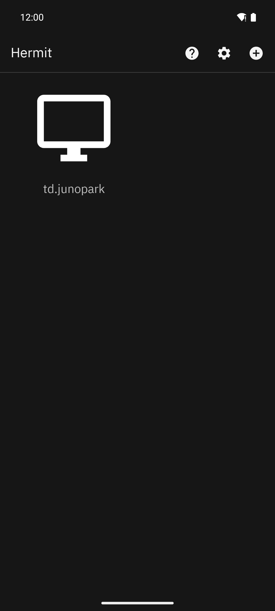
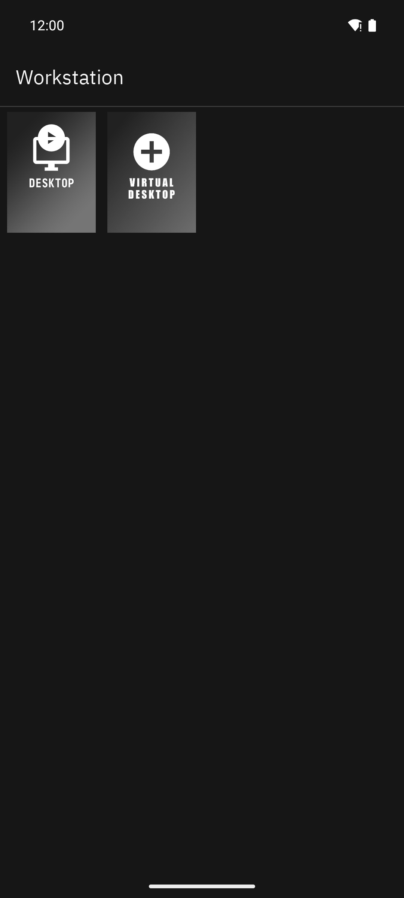
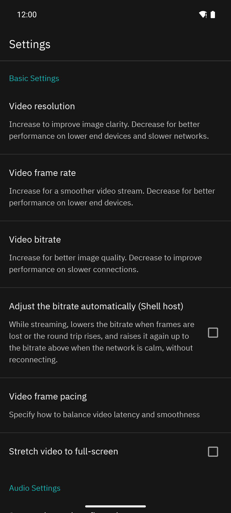
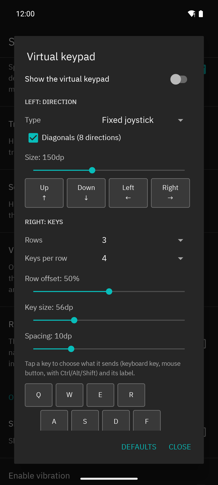
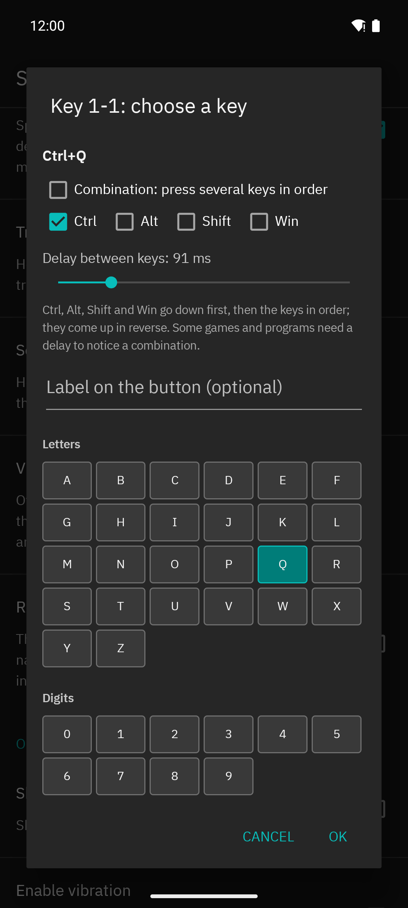

# Hermit for Android

[한국어](README.ko.md)

Hermit streams your PC's desktop, apps and games to an Android phone, tablet or TV. It is a
GameStream-protocol client built for remote desktop work as much as for gaming: touch the PC screen
directly, type in any language, send shortcuts that touch keyboards lack, and tune the stream while
it runs.

Hermit is the Android client of a small family:

- **[Shell](https://github.com/junopark00/hermit-shell)**: the host for Windows PCs.
- **[Hermit](https://github.com/junopark00/hermit)**: the Windows client.
- **Hermit for Android**: this repository.

Hermit also connects to other GameStream-compatible hosts such as Sunshine and Apollo. Features that
rely on Shell's extensions are marked below.

<p align="center">
  
  
  
</p>
<p align="center">
  
  
</p>

## Highlights

- **Direct touch**, in the style of Chrome Remote Desktop: tap to click, drag to scroll, long-press
  and drag to select or move, two-finger tap for a right click.
- **Trackpad mode** with precise pointer motion and adjustable speed.
- **Text input bar**: type whole sentences with the on-screen keyboard, including Korean and other
  Unicode text, independent of the PC's input language. A shortcut row adds Esc, Tab, arrows,
  Ctrl+C/V/Z, Alt+Tab, Win, Ctrl+Shift+Esc and Ctrl+Alt+Del (Ctrl+Alt+Del needs Shell).
- **Virtual keypad**: an on-screen joystick or d-pad plus keys you bind yourself, with modifier
  combinations, multi-key combos with adjustable delays, live editing over the stream and a quick
  menu for touch mode, quality, orientation and more.
- **Stream settings panel**: Back opens a panel instead of ending the stream. Change the overlay,
  orientation and input instantly; change the bitrate live without reconnecting (Shell), or apply
  resolution, frame rate, codec and HDR with a quick reconnect.
- **Automatic bitrate** that follows frame loss and round-trip time (Shell).
- **Resolutions that fit the screen**: besides the 16:9 sizes, the resolution lists offer 720p,
  1080p, 1440p and (where 4K is supported) 2160p sizes in this device's own aspect ratio, for
  example 1600×720 and 3200×1440 on a 20:9 phone or 1728×1080 on a 16:10 tablet, so the picture
  fills the screen without typing a custom size.
- **Pinch zoom** of the stream on the device, up to 500%, with accurate touch on the zoomed picture.
- **Screen orientation**: automatic from the stream's shape, or locked to landscape or portrait.
- **Performance overlay** with selectable metrics, including estimated end-to-end latency and the
  device's battery and thermal state.
- **Session summary** after each stream, compared with your recent sessions.
- **Clipboard sync** in both directions for text, and images too with Shell. Files are not synced.
- **Remote shutdown and restart** of the PC from the PC list (Shell).
- **Automatic reconnect** after a network drop.
- **English and Korean** interface, in a dark theme shared with Hermit for Windows.

All features are described in the [feature guide](docs/guide.md).

## Compatibility

| Feature | Shell | Other GameStream hosts (Sunshine, Apollo, ...) |
|---|---|---|
| Streaming, pairing, touch, trackpad, keypad, text input, zoom, overlay | Yes | Yes |
| Live bitrate change without reconnecting | Yes | Applied by reconnecting |
| Automatic bitrate | Yes | No |
| Ctrl+Alt+Del | Yes | No (Windows ignores it as ordinary input) |
| Clipboard sync: text | Yes | Hosts with the same clipboard extension (e.g. Apollo) |
| Clipboard sync: images | Yes | No |
| Clipboard sync: files | No | No |
| Remote shutdown and restart | Yes | No |

## Requirements

- Android 5.0 (API 21) or later, on phones, tablets, Chromebooks and Android TV.
- Some features need newer versions: pinch zoom needs Android 7.0; the text input bar sits right
  above the keyboard on Android 11 and later (at the top of the screen before that); crash reports
  include native crashes and "app not responding" events on Android 11 and later; the IBM Plex
  interface font is used on Android 10 and later.
- A host PC running Shell or another GameStream-compatible host.

## Installation

1. Download the latest `Hermit-android-<version>.apk` from
   [GitHub Releases](https://github.com/junopark00/hermit-android/releases).
2. Open it on the device. The first time, Android asks you to allow installs from the app you opened
   it with (for example your browser or file manager).
3. Updates install over the existing app and keep your pairing and settings, as long as they are
   signed with the same key. Release APKs are signed with the project's release key; you can check
   the certificate with `apksigner verify --print-certs Hermit-android-<version>.apk`. An APK signed
   with a different key (for example your own build) cannot update an installed release: uninstall
   first, which removes the pairing and settings.

Hermit uses its own application ID (`io.github.junopark00.hermit`), so it installs next to other
GameStream clients without affecting them.

## First connection and pairing

1. Start the host on your PC (for Shell, see its README).
2. Open Hermit. PCs on the same network appear automatically. For a PC on another network, tap **+**
   and enter its IP address or host name.
3. Tap the PC. Hermit shows a PIN: enter it on the host's pairing page (in Shell: web UI →
   Pairing), or tap **Open Shell pairing page** to open that page in your browser with the PIN
   filled in (the browser warns about the host's self-signed certificate and asks for the Shell
   web UI password). The dialog closes when pairing is complete.
4. Tap the PC again to see its apps, and tap an app (for example Desktop) to start streaming.

While streaming, press **Back** (or tap the handle at the screen edge) for the stream settings panel.
The **?** button on the PC list opens the [feature guide](docs/guide.md).

## Building from source

Requirements:

- JDK 21
- Android SDK with platform 37 and NDK 29.0.14206865 (the version in `app/build.gradle`), for example
  through Android Studio's SDK Manager
- Git (the streaming core is a submodule)

```sh
git clone --recursive https://github.com/junopark00/hermit-android.git
cd hermit-android
# or, in an existing clone: git submodule update --init --recursive
./gradlew assembleNonRootRelease      # Windows: gradlew.bat assembleNonRootRelease
```

The APK is written to `app/build/outputs/apk/nonRoot/release/`. `assembleNonRootDebug` builds a debug
version (`io.github.junopark00.hermit.debug`) that installs next to the release; its native code is
not optimised, so use it for debugging rather than streaming.

### Signing

Release builds are signed when a `keystore.properties` file exists in the repository root (it is
git-ignored; never commit it or the keystore). Without it, the release APK is unsigned. Use your own
key:

```properties
storeFile=C:/path/to/your-release-key.jks
storePassword=your-store-password
keyAlias=your-key-alias
keyPassword=your-key-password
```

A key can be created with the JDK's `keytool`:

```sh
keytool -genkeypair -keystore your-release-key.jks -storetype PKCS12 -alias your-key-alias \
  -keyalg RSA -keysize 4096 -validity 36500 -dname "CN=Your Name"
```

A relative `storeFile` is resolved against the `app/` directory, so an absolute path is simplest. Back
up the keystore and its passwords: Android only accepts updates signed with the same key.

### Windows helper

`hermit/build-android.ps1` finds a JDK and the Android SDK (`JAVA_HOME` / `ANDROID_HOME` first, then
common install locations), runs the source checks, builds the release APK and copies it to
`build/hermit-android/`. Without a `keystore.properties` it creates a new key in `./signing`
(git-ignored); back that folder up.

```powershell
.\hermit\build-android.ps1                  # release APK
.\hermit\build-android.ps1 -Install         # build and install over adb
.\hermit\build-android.ps1 -SmokeTest       # install, start and check that the app keeps running
.\hermit\build-android.ps1 -DebugBuild
.\hermit\build-android.ps1 -SignerName "Your Name"   # certificate name for a newly created key
```

### Checks

Before sending a change, run the source checks; they catch mistakes that compile but crash at
runtime:

```sh
python hermit/check-view-types.py
python hermit/check-strings.py
python hermit/check-prefs.py
```

The `root` flavour (rooted devices up to Android 7.1) is kept from the upstream project but is not
released.

## Privacy and network

Hermit has no accounts, no analytics and no telemetry. It contacts:

- **The hosts you add or that it finds** on your local network (mDNS discovery), for pairing,
  streaming, app lists and box art, clipboard sync and Wake-on-LAN packets.
- **A public STUN server, `stun.cloudflare.com`** (UDP 3478), when it finds a PC on your local
  network. STUN only reports your network's public address, which Hermit stores with the PC so you
  can reach it from outside later. No information about you or the host is sent.
- **GitHub**, only when you open the feature guide with the **?** button (in your browser, or in Hermit's
  built-in viewer on Android TV and when no browser is available).

Crash reports are stored on the device. They leave it only if you copy or share them yourself from
the crash dialog.

## Contributing and security

See [CONTRIBUTING.md](CONTRIBUTING.md) for how to report bugs and send changes, and
[SECURITY.md](SECURITY.md) for reporting vulnerabilities privately.

## License and credits

Hermit for Android is licensed under the [GNU General Public License v3.0](LICENSE.txt).

It is a modified version of [Moonlight for Android](https://github.com/moonlight-stream/moonlight-android)
by Cameron Gutman, Diego Waxemberg and the Moonlight contributors, and streams through
[moonlight-common-c](https://github.com/moonlight-stream/moonlight-common-c). Many thanks to the
Moonlight project, without which Hermit would not exist. Third-party components and their licenses
are listed in [NOTICE](NOTICE).

## Disclaimer

Hermit is an independent project. It is not affiliated with, endorsed by or sponsored by NVIDIA or the
Moonlight project. GameStream and NVIDIA are trademarks of NVIDIA Corporation. All other trademarks
belong to their respective owners.
